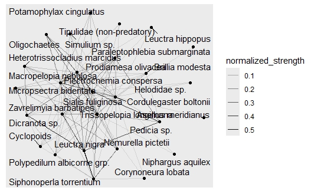

<center></center>

To add images, replace `tutheaderbl1.png` with the file name of any image you upload to your GitHub repository.

### Tutorial Aims

#### <a href="#section1"> 1. Extract ecological data from external library `cheddar`</a>

#### <a href="#section2"> 2. Tidy and calculate ecological data useful for food webs</a>

#### <a href="#section3"> 3. Visualise feeding relations of a food web using `igraph` and `ggraph` package </a>

#### <a href="#section4"> 4. Visualise biomass flow of a food web using `ggplot2`</a>


### Key Steps you will go through in this tutorial:

1.	Download data from `cheddar`

2.	Subset, extract and modify data using `dplyr`

  a.	Combining node and trophic link data from cheddar into long format table
  
  b.	Calculating biomass flow and interaction strength
  
3.	Visualise feeding relations of a food web using  `ggraph`  package

4.	Visualise data as heatmap in `ggplot2`

  a.	Using `geom_tile` as a template
  
  b.	Make the heatmap interactive with `plotly`

---------------------------

## Introduction

Species interactions in ecosystems form the basis of many ecological studies, but numbers and names alone are often difficult to interpret. When investigating the feeding relations between organisms, ecologists can use **food web networks** and **heatmaps**, which best present datasets that include a list of predator (consumer) species, prey (resource) species, and interaction strength (OR, biomass and density). Such visual depiction can be done on `RStudio` via versatile R packages that allow colourful, customizable presentations of data, including (but not limited to) `ggraph` and `ggplot2`.

In this tutorial, you will learn how to visualize food webs in two formats: **network diagrams** and **heat maps**, along with the necessary **data manipulation** steps beforehand. Network diagrams help identify food chains and trophic levels, with nodes representing species and edges showing interactions. Heat maps, on the other hand, focus on the strength of interactions between species using color gradients. You will first learn how to prepare your data, including organizing species and calculating interaction strength. Then, we will create network plots with `ggraph` to highlight predator-prey relationships, followed by heat maps using `ggplot2` to display interaction intensities. By the end of this tutorial, you’ll be equipped with the skills to visualize food webs effectively and interpret their ecological significance.

You can get all of the resources for this tutorial from <a href="https://github.com/EdDataScienceEES/tutorial-keenmustard.git" target="_blank">this GitHub repository</a>. Clone and download the repo as a zip file, then unzip it.

Before you dive into this tutorial, it is recommended you are familiar with the [basic dplyr operations]( https://ourcodingclub.github.io/tutorials/data-manip-intro/ ) and [data visualisation]( https://ourcodingclub.github.io/tutorials/datavis/).

<a name="section1"></a>

## 1. Extract ecological data from external library `cheddar`


To map energy flow or predator-prey interactions in an ecosystem, ecologists often track which species are present, their population density and biomass per capita. We call species, or groups of species involved in the food web ‘nodes’; and links are lines connecting nodes, that indicate a predator-prey relationship. 

`cheddar` is a package specialised for analysis and visualisation of ecological communities in R, with a few built-in datasets. (For more details on the package, visit its [official repository](https://github.com/quicklizard99/cheddar ).) However, in this tutorial, this package will primarily serve as a portal to the `BroadstoneStream` freshwater dataset from _Quantification and resolution of a complex, size-structured food web_ by Woodward, Speirs, and Hildrew (2005). 

To start off, create a new R script with a few lines of information at the top and you’re good to go (remember to use hasthags # for all annotations).

```r
# Visualising Food Webs on R
# Your name
# DD/MM/YYYY`

```
Now, let’s install and load libraries of all packages required in this tutorial, and import the dataset from `cheddar`. 

```r
# Install arequired packages (omit if you already have them installed)
install.packages("cheddar") # data and functions for analysing/visualising food web data
install.packages("tidyverse") # includes data wrangling tools such as dplyr, tidyr
install.packages("ggplot2") # a useful graphic display tool
install.packages("igraph") # helps visualise food web network
install.packages("ggraph") # an extension of ggplot2, creates food web heat map

# Load required libraries
library(cheddar)
library(tidyverse) 
library(ggplot2)
library(igraph) 
library(ggraph)

# Obtain the BroadstoneStream dataset from cheddar and save the useful data frames as objects
data("BroadstoneStream")
node_properties <- NPS(BroadstoneStream) # Extract node properties (species data)
trophic_links <- TLPS(BroadstoneStream) # Extract trophic links (prey-predator interactions)
properties <- BroadstoneStream[["properties"]] # Extract properties (unit key)

```
Alternatively, if you don’t wish to install `cheddar`, the data frames (nodes.csv and trophiclinks.csv) are included in [this](https://github.com/EdDataScienceEES/tutorial-keenmustard.git) `Github` repository, which also holds this tutorial’s sample script.   

```r
# ALTERNATIVE: To directly access data without cheddar, instead of ("BroadstoneStream"), use the below code:
node_properties <- read.csv("broadstonestream_data/nodes.csv")   # Extract node properties (species data)
trophic_links <- read.csv("broadstonestream_data/trophic_links.csv")  # Extract trophic links (prey-predator interactions)
properties <- read.csv("broadstonestream_data/properties.csv")  # Extract properties (unit key)

```

There are 3 data frames in total - `trophic_links`,`node properties` and `properties`. `properties` is not required in calculations, but it tells us about the units used. Let’s see what we've got:

```r
# Examine data properties
str(properties)
str(node_properties)
str(trophic_links)
```

`node_properties` shows 37 entries of species, along with their mass (`M`) , density (`N`), and the taxonomic groups they belong to. According to `properties`, `M` (mass) and `N` (density) columns have mg and m^-2 (per square meter) as units respectively.

`trophic_links` includes two columns only, with each row being a predator-prey pair. 


<a name="section2"></a>

## 2. Subset, extract and modify data using dplyr 

We can now move on to tidy the data frames we have just extracted. If we try run some code, we could gain even deeper understanding of which nodes are present, and between which ones should connections exist. 

```r
# Let's view what species do we have exactly!
unique(node_properties$node) 
```
There are some producers (`Algae`) and detritus (`CPOM` and `FPOM`) here! I would assume they are resources. Let's see if they are in `trophic_links$resource`.

```r
unique(trophic_links$resource) 
```
They don't seem to be! If we run another few lines line to find differences...

```r
# Create data frames containing characters in nodes' but not 'resources'; and vice versa
nodes_not_in_resources <- setdiff(unique(node_properties$node), unique(trophic_links$resource))
resources_not_in_nodes <- setdiff(unique(trophic_links$resource), unique(node_properties$node))
# And display the result...
list(Nodes_Not_in_Resources = nodes_not_in_resources,
  Resources_Not_in_Nodes = resources_not_in_nodes)

```

From the code output, we can tell that the producer (`algae`) and detritus (`CPOM` and `FPOM`) are not recorded as resources in trophic links. This implies our food web will focus on trophic levels from primary consumer onwards. Additionally, we also see invertebrates including _Platambus maculatus_ and _Adicella reducta_ not included in prey, implying such organisms are in the top trophic level.

What we still need to know is the **interaction strength** between a predator-prey duo, which, with limited data, can be represented with **biomass flux** instead, estimated by $$ I = \frac{M_j \times N_j}{M_i} $$ where \( I \) = The interaction strength between predator and prey; \( M_j\) = Mass (or biomass) of the prey species\( N_j\); N_j= Density of the prey species (j) ; \( M_i\): Mass (or biomass) of the predator species (i).

Run the below code (written in our favourite `tidyverse` format) to calculate \( M_j\) * \( N_j\) and \( M_i\) for every node. Please note that at this step, it seems like we are ridiculously assuming each node could be prey and predator simultaneously – even though there are definitely prey-only and predator-only nodes (e.g. `Diptera` and _Platambus maculatus_ we saw from the last step were not found in the list of `resource`) in this ecosystem. But don’t worry, we won’t end up using every value calculated here. At this step we just can’t tell which ones are prey- or predator-only yet since the trophic links are recorded in another data frame. 

```r
# Calculate biomass (M * N) for prey and keep only mass for predators
node_properties <- node_properties %>%
  mutate(
    prey_biomass = M * N,  # Prey biomass includes mass and density
    predator_mass = M      # Predator biomass is just the mass
  ) %>%
  select(node, prey_biomass, predator_mass)  # Keep only necessary columns 
```
Now that we have gotten every node’s prey total biomass and predator biomass, we could assign the values to each corresponding predator-prey pair via joining `node_properties` to `trophic_links` with `dplyr`’s `left_join()`.

```r
# Joining trophic_links with node_properties
trophic_links <- trophic_links %>%
  # Add prey biomass by joining on 'resource' (prey nodes)
  left_join(node_properties %>% select(node, prey_biomass), by = c("resource" = "node")) %>%
  # Add predator mass by joining on 'consumer' (predator nodes)
  left_join(node_properties %>% select(node, predator_mass), by = c("consumer" = "node"))
```
Finally, we can calculate $I$ for each interacting pair (Hint: \( I = \frac{M_j \times N_j}{M_i} \)) only to see the resulting values of \( I \)  are not exactly straightforward. Fortunately, for easier interpretation we can **normalise** $I$, such that it shows how much biomass one prey node contributes to a given predator species, as a **proportion over the total prey biomass flux to that predator species**. For instance, if a predator-prey pair has a normalised value of 0.1, it means this prey species contributes to 10% of the total biomass making up the predator’s diet. 

```r
# Calculate and normalise interaction strength
food_web <- trophic_links %>% # Rename the data frame as it not only contains trophic links now
  group_by(consumer) %>%  # Normalised strengths are based on single predator 
  mutate(
    # Calculate interaction strength (I)
    interaction_strength = prey_biomass / predator_mass,  
    # Normalize interaction strength 
    normalized_strength = interaction_strength / sum(interaction_strength, na.rm = TRUE)
  ) %>%
  ungroup()  # Ungroup after calculations to avoid accidental grouping later 
```
Great! We’ve now got some neat data ready for visualisation, all in `food_web`.

<a name="section3"></a>

## 3.	Visualise data as food web network with `ggraph`

The most straightforward and common way to present feeding relationships is to use a **food web network**, with links connecting labelled nodes. To achieve that, we will firstly be using `igraph`, a package that specialises in converting data into network. Run the code below: 

```r
# Convert our food_web data frame to an igraph object
food_web_plot <- graph_from_data_frame(food_web, directed = TRUE)
```
What we just did was to make a plottable object `food_web_plot using the `igraph` function, `graph_from_data_frame()`. `directed = TRUE` tells `igraph` that the links are **directional** – only ‘ prey to predator ’ is valid, not the other way round. If you are curious, you could see the structure of the plottable `igraph` object with:

```r
# OPTIONAL: View what igraph did to our data!
print(food_web_plot)
```
A _very_ lengthy output will be returned. Essentially, the object is comprised of: a layout table containing 27 rows and 6 columns (all information from the original table), 3 `ggplot2`-like layers, an a bunch of other properties suited for plotting. This way, our data becomes compatible with the plotting commands we are about to use: 

- `geom_node_point()` :directly identifies nodes from our data and plot them as points
- `geom_edge_link()`: adds a layer of geometry to represent network links

In a format similar to `ggplot2` plots, we can code for a network to display our feeding relations: 

```r
# Coding for a food web network and save it as an object
food_web_network <- ggraph(food_web_plot) +  # Calls for a plot using package ggraph
  geom_node_point() +  # Add a layer to plot our nodes as points 
  geom_edge_link(aes(alpha = normalized_strength)) +  # Add another layer to plot our links based on normalised_strength
  geom_node_text(aes(label = name), repel = TRUE, size = 4)   # Lastly, label our nodes!
# View our plot 
print(food_web_network)
```
This is what the plot should look like:

<center></center>

Pro tip: **Always** click `Zoom` on the `Plot` tab for a clearer view!

Our plot contains the basic elements – nodes and links… and nothing else. 

But just like a `ggplot2` graph, we can add a few more lines of code to give this crude and unpolished network an upgrade! Currently, the labels are too messy, links lack direction, and the colour intensity of the links is hard to distinguish… 

Let’s run the code below: 

```r
# Use ggraph to visualize the food web again, but make it prettier
food_web_network <- ggraph(food_web_plot, layout = 'fr') +  # Fruchterman-Reingold layout tends to cluster interacting species together
  geom_edge_link(
    aes(color = normalized_strength), # Plot edges (links) and colour them based on normalized strength
    arrow = arrow(length = unit(5, "mm"), type = "closed")  # Add arrowheads to show who's predator who's prey
  ) +  
  scale_edge_color_gradient(low = "green", high = "red", name = "Normalized Interaction Strength") +  # Customise normalized strength gradient 
  geom_node_label(
    aes(label = name), # Instead of adding node circle and labelling text separately, add nodes as rectangular labels directly
    fill = "white", # Customise box colour to white
    color = "black", # Customise text colour to black
    size = 2.5,  # Customise text size
    label.size = 0.25 # Customise the label's border size
  ) +  
  theme_void() +  # Removes the grey panel in the background
  labs(title = "Broadstone Stream Food Web")+  # Add title
  theme(plot.title = element_text(hjust = 0.5))  # Center the title
# View the plot 
print(food_web_network)
```
`Zoom` into the graph for a clearer view, and it should look like this now. 

PICTURE

Pretty interpretable! We can identify **food chains** from our web and locate the **apex predators** –note that some nodes, for example _Corduligester boltonii_ and _Macropelopia nebulosa_ are surrounded by many arrowheads. In addition, most species seem to be rather generalist with many links of low strength, with the exception of _Leuctra nigra_ being the dominant prey for _Siphonoperla torrentium_ and _Dicranotas sp._. 

In case there are still **label overlaps** after zooming, you can always **save the plot as an image** and adjust its width and height. For my sample code, this is my recommended dimensions: `ggsave("food_web_plot.png", plot = food_web_network, width = 15, height = 15, dpi = 300) `. The image `food_web_plot.png` will be saved in the working directory. 

<a name="section4"></a>

## 4.	Visualise data as heatmap with `ggplot2`

Food web networks give a holistic view of the ecosystem’s feeding relations, but in case you would like to focus more on the **quantitative aspects** of the web, **biomass flow heat map** is the better alternative since it displays interaction strength in a clearer manner compared to a food web network.

To build a heat map, we can stick to `ggplot2`, using the `geom_tile()` function. It creates rectangular tiles where the fill colour of each tile represents the value of a variable. Each tile corresponds to a specific **pair of variables** on the x and y axes (in our case, the predator and the prey), and the **colour gradient** encodes a **third variable**. Use the code below to build a simple heat map using our `food_web` data frame: 

```r
# Build a biomass flow heatmap (predator on horizontal axis, prey on vertical axis, colour represents normalized interaction strength)
heatmap_plot <- ggplot(food_web, aes(x = consumer, y = resource, fill = normalized_strength)) +
  geom_tile() + # Add a tile plot layer as the heatmap
  labs( # Add the title and labels
    title = "Food Web Heatmap of Interaction Strength",
    x = "Predator", 
    y = "Prey")
# Let's take a look at the heatmap
print(heatmap_plot) 
```
And the heat map should look similar to this: 

PICTURE

We have just created the _most_ basic heatmap! Obviously, **there are some major issues with it** – the labels are horizontal by default on the x axis, the grid doesn’t align with the tiles, and the colours are not distinct enough from each other. We can fix those flaws with more lines of code:

```r
# Improve the heatmap
heatmap_plot <- ggplot(food_web, aes(x = consumer, y = resource, fill = normalized_strength)) +
  geom_tile(color = "#4d4d4d", size = 0.2) + # Colour the border so we can easily count the number of tiles
  scale_fill_gradient(low = "green", high = "red",# Change to a more distinctive colour gradient
                      name = "Normalized Interaction Strength")+  # Set the legend title here
  theme_minimal() + # choose a 
  labs(title = "Food Web Heatmap of Interaction Strength", # Add the title and labels
       x = "Predator", y = "Prey") +
  theme(
    axis.text.x = element_text(angle = 90, hjust = 1), # Rotate labels such that they don't overlap on the x-axis
    title = element_text(hjust = 0.5), # Centre the title
    panel.grid = element_blank(), # Removes confusing grid
  ) 
# View the heatmap
print(heatmap_plot)
```
A neat, readable plot is now ready: 

PICTURE

Looking at this figure rather than food web network, we now take less effort to notice **which prey species is fed to highest number of predators** e.g. _Leuctra nigra_ (and vice versa) by counting the number of coloured boxes. We can also easily identify **specialist predators**, by looking for predator nodes with few total numbers of boxes that are dominantly red, e.g. _Dicranota sp._ and _Siphonoperla torrentium_. 

At this point, you might notice there’s still an unsolved problem with this graph – as a reader, we **can’t interpret normalized interaction strengths accurately** based on the colour gradient! 

But here's the trick – convert the heatmap into an **interactive plot** via `plotly`. `plotly` is a data visualization library that enables features like zooming, panning, tooltips, and real-time interactivity. In this tutorial, we will utilize this package to **display normalized strength values when our cursor hovers over the tile**. 

```r
# Convert the ggplot heatmap to an interactive plotly plot
interactive_heatmap <- ggplotly(heatmap_plot) 
# Display the interactive plot
interactive_heatmap
```

Here’s how the labels should show up when you hover over a tile:

PICTURE

Unfortunately, when converting `ggplot2` heatmap into an interactive object, **not all elements are kept**, e.g. the grey border of the tiles. In fact, there are libraries on R specialised in heatmaps that allows greater freedom in customizations. If you are considering making a more advanced heatmap, libraries like [`heatmaply`](https://github.com/talgalili/heatmaply) might be the perfect tool! 

**Nonetheless, you have reached the end of the tutorial!** You are now competent in

##### -	Extracting and manipulating ecological data for food web visualisation
##### -	Visualising food web as networks using `igraph` and `ggraph`
##### -	Visualising biomass flow with heatmaps using `ggplot2`
##### -	Using `plotly` to enhance plot display

Happy coding!


We can also provide some useful links, include a contact form and a way to send feedback.

For more on `ggplot2`, read the official <a href="https://www.rstudio.com/wp-content/uploads/2015/03/ggplot2-cheatsheet.pdf" target="_blank">ggplot2 cheatsheet</a>.

<hr>
#### Related tutorials: 
- [Graphics guide, mostly ggplot2](ase.tufts.edu/bugs/guide/assets/R%20Graphics%20Cookbook.pdf)

<hr>

#### Check out our <a href="https://ourcodingclub.github.io/links/" target="_blank">Useful links</a> page where you can find loads of guides and cheatsheets.

#### If you have any questions about completing this tutorial, please contact us on ourcodingclub@gmail.com

#### <a href="INSERT_SURVEY_LINK" target="_blank">We would love to hear your feedback on the tutorial, whether you did it in the classroom or online!</a>

<ul class="social-icons">
	<li>
		<h3>
			<a href="https://twitter.com/our_codingclub" target="_blank">&nbsp;Follow our coding adventures on Twitter! <i class="fa fa-twitter"></i></a>
		</h3>
	</li>
</ul>

### &nbsp;&nbsp;Subscribe to our mailing list:
<div class="container">
	<div class="block">
        <!-- subscribe form start -->
		<div class="form-group">
			<form action="https://getsimpleform.com/messages?form_api_token=de1ba2f2f947822946fb6e835437ec78" method="post">
			<div class="form-group">
				<input type='text' class="form-control" name='Email' placeholder="Email" required/>
			</div>
			<div>
                        	<button class="btn btn-default" type='submit'>Subscribe</button>
                    	</div>
                	</form>
		</div>
	</div>
</div>
