<center></center>

To add images, replace `tutheaderbl1.png` with the file name of any image you upload to your GitHub repository.

## Manipulating, Visualising and Statistically Interpreting Food Web Data on R

### Tutorial Aims

#### <a href="#section1"> 1. Extract and tidy ecological data from external library `cheddar`, and calculate data useful for food webs</a>

#### <a href="#section2"> 2. Visualise feeding relations and biomass flow of a food web using `igraph`, `ggraph`, and `ggplot2`</a>

#### <a href="#section3"> 3. Building functions for statistical analysis of food web data to investigate keystone species, using `igraph` and base R functions </a>


### Key Steps you will go through in this tutorial:

1. Extract, subset and modify data using `cheddar` and `dplyr`  
   a. Download data from `cheddar`
   b. Combine node and trophic link data from `cheddar` into long format table
   c. Calculate biomass flow and interaction strength  


2. Visualise feeding relations of a food web using `igraph`, `ggraph` and `ggplot2`  
   a. Visualise feeding relationships by `ggraph`ing a network based on `igraph` object  
   b. Visualise biomass flow as heatmap in `ggplot2` using `geom_tile` as a template 
   c. Create an interactive heatmap  


3. Develop and apply a function to evaluate the impact of species removal  
   a. Build functions to simulate secondary extinctions by removing targeted and random species 
   b. Compare targeted species removal to random removal using a permutation test


---------------------------

### Introduction

Species interactions in ecosystems form the basis of many ecological studies, but numbers and names alone are often difficult to interpret. When investigating the feeding relations between organisms, ecologists can use **food web networks** and **heatmaps**, which best present datasets that include a list of predator (consumer) species, prey (resource) species, and interaction strength (OR, biomass and density). Such visual depiction can be done on `RStudio` via versatile R packages that allow colourful, customizable presentations of data, including (but not limited to) `ggraph` and `ggplot2`.

<p align="center">
  <div style="display:inline-block; text-align:center; width:45%; margin-right: 10px;">
    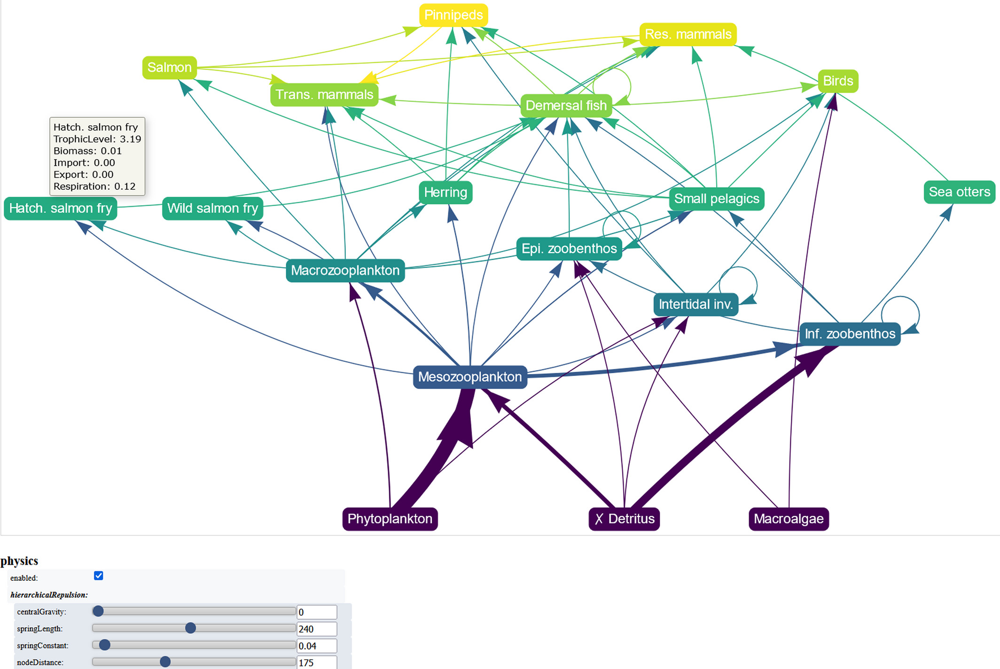
    <br>
    Heat maps showing carbon flow in an oceanic food web, Richards Bay, South Africa (Scharler et al. 2016). (Source: <a href="https://besjournals.onlinelibrary.wiley.com/doi/full/10.1111/2041-210X.13839" style="color: inherit; text-decoration: none;">Pawluczuk and Iskrzyński, 2022</a>)
  </div>
  <div style="display:inline-block; text-align:center; width:45%;">
    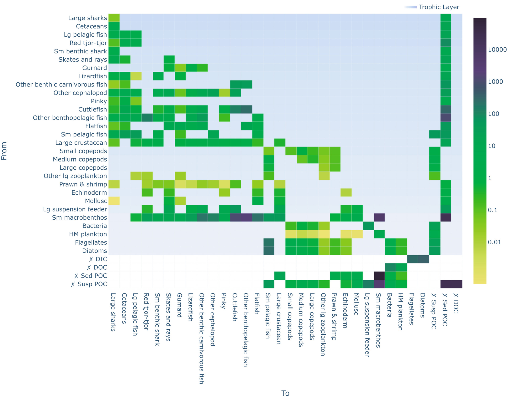
    <br>
    Food web network graph of the Prince William Sound, Alaska (Dalsgaard et al., 1997). (Source: <a href="https://besjournals.onlinelibrary.wiley.com/doi/full/10.1111/2041-210X.13839" style="color: inherit; text-decoration: none;">Pawluczuk and Iskrzyński, 2022</a>)
  </div>
</p>


In this tutorial, you will learn how to visualize food webs in two formats: **network diagrams** and **heat maps**, along with the necessary **data manipulation** steps beforehand. Network diagrams help identify food chains and trophic levels, with nodes representing species and edges showing interactions. Heat maps, on the other hand, focus on the strength of interactions between species using color gradients. You will first learn how to prepare your data, including organizing species and calculating interaction strength. Then, we will create network plots with `ggraph` to highlight predator-prey relationships, followed by heat maps using `ggplot2` to display interaction intensities. You’ll also learn how to build functions to simulate species removal and assess its ecological consequences, in terms of disconnection. These functions help quantify the cascading effects of species loss by identifying disconnected species and calculating the extent of trophic disruption. By the end of this tutorial, you’ll be equipped with the skills to visualize food webs effectively and statistically interpret species' ecological significance.

You can get all of the resources for this tutorial from <a href="https://github.com/EdDataScienceEES/tutorial-keenmustard.git" target="_blank">this GitHub repository</a>. Clone and download the repo as a zip file, then unzip it.

<div style="background-color: #c4f5c9; padding: 15px; border-radius: 10px; border: 2px solid #c4f5c9;">
    Before you dive into this tutorial, it is recommended you are familiar with the <a href="https://ourcodingclub.github.io/tutorials/data-manip-intro/" style="color: #0077cc; text-decoration: none;">basic dplyr operations</a>, 
    <a href="https://ourcodingclub.github.io/tutorials/datavis/" style="color: #0077cc; text-decoration: none;">data visualisation</a> and 
    <a href="https://ourcodingclub.github.io/tutorials/funandloops/" style="color: #0077cc; text-decoration: none;">function building</a>.
</div>


<a name="section1"></a>

### 1. Extract, subset and modify data using cheddar and dplyr 

### 1a. Extract ecological data from external library `cheddar`

<p align="center">
  <div style="display:inline-block; text-align:center; width:45%; margin-right: 10px;">
    
    <br>
    A network in math, where nodes are called 'vertices', and links are called 'edges', just like how most R functions do. (Source: <a href="https://mathinsight.org/network_introduction" style="color: inherit; text-decoration: none;">Nykamp DQ</a>)
  </div>
  <div style="display:inline-block; text-align:center; width:45%;">
    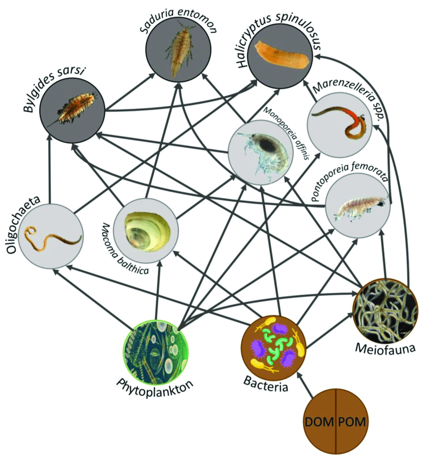
    <br>
    A food web network in ecological contexts, where the organisms are nodes, and lines between them indicate feeding relationships. (Source: <a href="https://www.researchgate.net/publication/362504250_Benthic_invertebrate_food_webs_in_the_Baltic_Sea_Anthropogenic_pressure_effects_and_methodological_advancements" style="color: inherit; text-decoration: none;">Garrison, J. (2022)</a>). 
  </div>
</p>


To map energy flow or predator-prey interactions in an ecosystem, ecologists often track which species are present, their population density and biomass per capita. **We call species, or groups of species involved in the food web nodes**; and **links are lines connecting nodes, that indicate a predator-prey relationship**. 

<figure style="text-align: center;">
    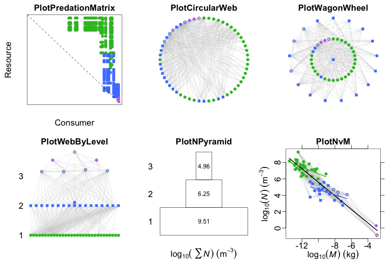
    <figcaption style="color: grey;"> There are many purposes of cheddar, but we will stick to ggplot and ggraph for simplicity today... (Source: <a href="https://quicklizard99.github.io/cheddar/" style="color: grey; text-decoration: none;">cheddar</a>) </figcaption>
</figure>


`cheddar` is a package specialised for analysis and visualisation of ecological communities in R, with a few built-in datasets. (For more details on the package, visit its [official repository](https://github.com/quicklizard99/cheddar ).) However, in this tutorial, this package will primarily serve as a portal to the `BroadstoneStream` freshwater dataset from _Quantification and resolution of a complex, size-structured food web_ by Woodward, Speirs, and Hildrew (2005). 

To start off, create a new R script with a few lines of information at the top and you’re good to go (remember to use hasthags # for all annotations).

<div class="code-container" style="position: relative;">
    <button class="copy-button" onclick="copyCode('code-block-ddmmyy')" style="position: absolute; top: 10px; right: 10px; background-color: #4CAF50; color: white; border: none; padding: 10px; border-radius: 5px;">Copy contents</button>
    <pre id="code-block-ddmmyy">
# Visualising Food Webs on R
# Your name
# DD/MM/YYYY
    </pre>
</div>

<script>
    function copyCode(codeBlockId) {
        const code = document.getElementById(codeBlockId);
        const textarea = document.createElement('textarea');
        textarea.value = code.textContent;
        document.body.appendChild(textarea);
        textarea.select();
        textarea.setSelectionRange(0, 99999);
        document.execCommand('copy');
        document.body.removeChild(textarea);
        alert('Code copied to clipboard!');
    }
</script>


Now, let’s install and load libraries of all packages required in this tutorial, and import the dataset from `cheddar`. 

<div class="code-container" style="position: relative;">
    <button class="copy-button" onclick="copyCode('code-block-1')" style="position: absolute; top: 10px; right: 10px; background-color: #4CAF50; color: white; border: none; padding: 10px; border-radius: 5px;">Copy contents</button>
    <pre id="code-block-1">
# Install required packages (omit if you already have them installed)
install.packages("cheddar") # data and functions for analysing/visualising food web data
install.packages("tidyverse") # includes data wrangling tools such as dplyr, tidyr
install.packages("ggplot2") # a useful graphic display tool
install.packages("igraph") # helps visualise food web network
install.packages("ggraph") # an extension of ggplot2, creates food web heat map
install.packages("plotly") # Allows plots to get interactive

# Load required libraries
library(cheddar)
library(tidyverse) 
library(ggplot2)
library(igraph) 
library(ggraph)
library(plotly)

# Obtain the BroadstoneStream dataset from cheddar and save the useful data frames as objects
data("BroadstoneStream")
node_properties <- NPS(BroadstoneStream) # Extract node properties (species data)
trophic_links <- TLPS(BroadstoneStream) # Extract trophic links (prey-predator interactions)
properties <- BroadstoneStream[["properties"]] # Extract properties (unit key)
    </pre>
</div>

<div style="background-color: #c4f5c9; padding: 15px; border-radius: 10px; border: 2px solid #c4f5c9;">
    Alternatively, if you don’t wish to install <code>cheddar</code>, the data frames (<code>nodes.csv</code>, <code>properties.csv</code>, and <code>trophic_links.csv</code>) are included in 
    <a href="https://github.com/EdDataScienceEES/tutorial-keenmustard.git" style="color: #0077cc; text-decoration: none;">this</a> 
    <code>Github</code> repository, which also holds this tutorial’s sample script.
    <div class="code-container" style="position: relative;">
        <button class="copy-button" onclick="copyCode('code-block-2')" style="position: absolute; top: 10px; right: 10px; background-color: #4CAF50; color: white; border: none; padding: 10px; border-radius: 5px;">Copy contents</button>
        <pre id="code-block-2">
# ALTERNATIVE: To directly access data without cheddar, instead of ("BroadstoneStream"), use the below code:
node_properties <- read.csv("broadstonestream_data/nodes.csv")   # Extract node properties (species data)
trophic_links <- read.csv("broadstonestream_data/trophic_links.csv")  # Extract trophic links (prey-predator interactions)
properties <- read.csv("broadstonestream_data/properties.csv")  # Extract properties (unit key)
        </pre>
    </div>
</div>

<div class="code-container" style="position: relative;">
    <button class="copy-button" onclick="copyCode('code-block-3')" style="position: absolute; top: 10px; right: 10px; background-color: #4CAF50; color: white; border: none; padding: 10px; border-radius: 5px;">Copy contents</button>
    <pre id="code-block-3">
# Examine data properties
str(properties)
str(node_properties)
str(trophic_links)
    </pre>
</div>

<script>
    function copyCode(codeBlockId) {
        const code = document.getElementById(codeBlockId);
        const textarea = document.createElement('textarea');
        textarea.value = code.textContent;
        document.body.appendChild(textarea);
        textarea.select();
        textarea.setSelectionRange(0, 99999);
        document.execCommand('copy');
        document.body.removeChild(textarea);
        alert('Code copied to clipboard!');
    }
</script>

And you should be greeted with the below information in the console: 

<table style="width:100%; border: 1px solid black; border-collapse: collapse;">
    <caption style="font-weight: bold; text-align: center;">Data Properties Overview</caption>
    <thead>
        <tr>
            <th>Species/Group</th>
            <th>Mass (M) <br> (mg)</th>
            <th>Density (N) <br> (m<sup>-2</sup>)</th>
            <th>Taxonomic Group</th>
        </tr>
    </thead>
    <tbody>
        <tr>
            <td>Cordulegaster boltonii</td>
            <td>9.725</td>
            <td>10</td>
            <td>Invertebrate, Arthropoda, Insecta, Odonata, Cordulegastridae</td>
        </tr>
        <tr>
            <td>Sialis fuliginosa</td>
            <td>2.756</td>
            <td>36</td>
            <td>Invertebrate, Arthropoda, Insecta, Megaloptera, Sialidae</td>
        </tr>
        <tr>
            <td>Plectrocnemia conspersa</td>
            <td>0.74</td>
            <td>82</td>
            <td>Invertebrate, Arthropoda, Insecta, Trichoptera, Polycentropodidae</td>
        </tr>
        <tr>
            <td>Pedicia sp.</td>
            <td>6.807</td>
            <td>2</td>
            <td>Invertebrate, Arthropoda, Insecta, Diptera, Tipulidae</td>
        </tr>
        <tr>
            <td>...</td>
            <td>...</td>
            <td>...</td>
            <td>...</td>
        </tr>
    </tbody>
</table>


`node_properties` shows 37 species/groups/resource types, along with their mass (`M`) , density (`N`), and the taxonomic groups they belong to. According to `properties`, `M` (mass) and `N` (density) columns have mg and m<sup>-2</sup> (per square meter) as units respectively.

`trophic_links` includes two columns only, with each row being a predator-prey pair. 


### 1b. Subset, extract and modify data using dplyr 

We can now move on to tidy the data frames we have just extracted. If we try run some code, we could gain even deeper understanding of which nodes are present, and between which ones should connections exist. 

<p>
    There are some producers (<em>Algae</em>) and detritus (<em>CPOM</em> and <em>FPOM</em>) here! I would assume they are resources. Let's see if they are in <code>trophic_links$resource</code>.
</p>

<div class="code-container" style="position: relative;">
    <button class="copy-button" onclick="copyCode('code-block-1')" style="position: absolute; top: 10px; right: 10px; background-color: #4CAF50; color: white; border: none; padding: 10px; border-radius: 5px;">Copy contents</button>
    <pre id="code-block-1">
unique(trophic_links$resource)
    </pre>
</div>

<p>
    They don't seem to be! If we run another few lines to find differences...
</p>

<div class="code-container" style="position: relative;">
    <button class="copy-button" onclick="copyCode('code-block-2')" style="position: absolute; top: 10px; right: 10px; background-color: #4CAF50; color: white; border: none; padding: 10px; border-radius: 5px;">Copy contents</button>
    <pre id="code-block-2">
# Create data frames containing characters in nodes' but not 'resources'; and vice versa
nodes_not_in_resources <- setdiff(unique(node_properties$node), unique(trophic_links$resource))
resources_not_in_nodes <- setdiff(unique(trophic_links$resource), unique(node_properties$node))
# And display the result...
list(Nodes_Not_in_Resources = nodes_not_in_resources,
  Resources_Not_in_Nodes = resources_not_in_nodes)
    </pre>
</div>

<script>
    function copyCode(codeBlockId) {
        const code = document.getElementById(codeBlockId);
        const textarea = document.createElement('textarea');
        textarea.value = code.textContent;
        document.body.appendChild(textarea);
        textarea.select();
        textarea.setSelectionRange(0, 99999);
        document.execCommand('copy');
        document.body.removeChild(textarea);
        alert('Code copied to clipboard!');
    }
</script>


| **Category**             | **Nodes**                                                                                              |
|--------------------------|-------------------------------------------------------------------------------------------------------|
| **Nodes Not in Resources** | Platambus maculatus, Bezzia sp., Adicella reducta, Pisidium sp., Terrestrial invertebrates, CPOM, FPOM, Leptothrix spp., Algae, Diptera |
| **Resources Not in Nodes** | None                                                                                                 |


From the code output, we can tell that the producer (`algae`) and detritus (`CPOM` and `FPOM`) are not recorded as resources in trophic links. This implies our food web will focus on trophic levels from primary consumer onwards. Additionally, we also see invertebrates including _Platambus maculatus_ and _Adicella reducta_ not included in prey, implying such organisms are in the top trophic level.

What we still need to know is the interaction strength between a predator-prey duo, which, with limited data, can be represented with biomass flux instead, estimated by:

I = (<i>M<sub>j</sub></i> × <i>N<sub>j</sub></i>) / <i>M<sub>i</sub></i>

where:
- <i>I</i>: The interaction strength between predator and prey  
- <i>M<sub>j</sub></i>: Mass (or biomass) of the prey species  
- <i>N<sub>j</sub></i>: Density of the prey species (<i>j</i>)  
- <i>M<sub>i</sub></i>: Mass (or biomass) of the predator species (<i>i</i>)

Run the below code (written in our favourite tidyverse format) to calculate <i>M<sub>j</sub></i> × <i>N<sub>j</sub></i> and <i>M<sub>i</sub></i> for every node. Please note that at this step, it seems like we are ridiculously assuming each node could be prey and predator simultaneously – even though there are definitely prey-only and predator-only nodes (e.g., Diptera and <i>Platambus maculatus</i> we saw from the last step were not found in the list of resources) in this ecosystem. But don’t worry, we won’t end up using every value calculated here. At this step, we just can’t tell which ones are prey- or predator-only yet since the trophic links are recorded in another data frame.
<p>
    Now that we have gotten every node’s prey total biomass and predator biomass, we could assign the values to each corresponding predator-prey pair via joining <code>node_properties</code> to <code>trophic_links</code> with <code>dplyr</code>’s <code>left_join()</code>.
</p>

<div class="code-container" style="position: relative;">
    <button class="copy-button" onclick="copyCode('code-block-3')" style="position: absolute; top: 10px; right: 10px; background-color: #4CAF50; color: white; border: none; padding: 10px; border-radius: 5px;">Copy contents</button>
    <pre id="code-block-3">
# Calculate biomass (M * N) for prey and keep only mass for predators
node_properties <- node_properties %>%
  mutate(
    prey_biomass = M * N,  # Prey biomass includes mass and density
    predator_mass = M      # Predator biomass is just the mass
  ) %>%
  select(node, prey_biomass, predator_mass)  # Keep only necessary columns
    </pre>
</div>

<p>
    Joining <code>trophic_links</code> with <code>node_properties</code>.
</p>

<div class="code-container" style="position: relative;">
    <button class="copy-button" onclick="copyCode('code-block-4')" style="position: absolute; top: 10px; right: 10px; background-color: #4CAF50; color: white; border: none; padding: 10px; border-radius: 5px;">Copy contents</button>
    <pre id="code-block-4">
# Joining trophic_links with node_properties
trophic_links <- trophic_links %>%
  # Add prey biomass by joining on 'resource' (prey nodes)
  left_join(node_properties %>% select(node, prey_biomass), by = c("resource" = "node")) %>%
  # Add predator mass by joining on 'consumer' (predator nodes)
  left_join(node_properties %>% select(node, predator_mass), by = c("consumer" = "node"))
    </pre>
</div>

<script>
    function copyCode(codeBlockId) {
        const code = document.getElementById(codeBlockId);
        const textarea = document.createElement('textarea');
        textarea.value = code.textContent;
        document.body.appendChild(textarea);
        textarea.select();
        textarea.setSelectionRange(0, 99999);
        document.execCommand('copy');
        document.body.removeChild(textarea);
        alert('Code copied to clipboard!');
    }
</script>

<figure style="text-align: center;">
    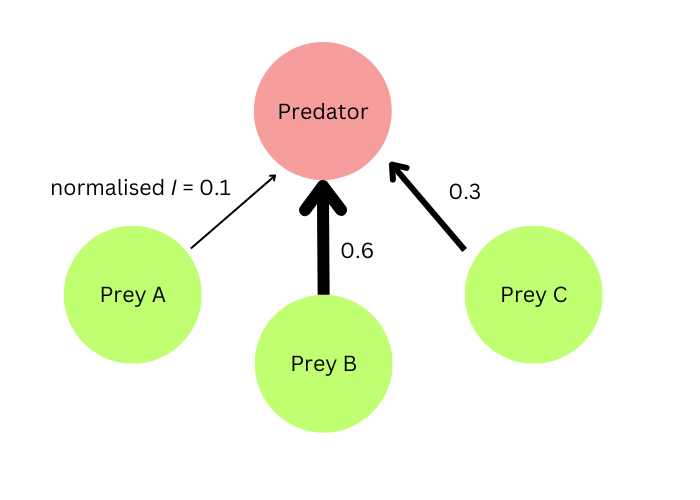
    <figcaption style="color: grey;">Prey A has a normalised interaction strength of 0.1 with the predator indicates only 10% of predator's biomass intake comes from Prey A. </figcaption>
</figure>

Finally, we can calculate <i>I</i> for each interacting pair (Hint: <i>I = <sup>M<sub>j</sub> × N<sub>j</sub></sup>/<sub>M<sub>i</sub></sub></i>) only to see the resulting values of <i>I</i> are not exactly straightforward. Fortunately, for easier interpretation, we can normalise <i>I</i>, such that it shows how much biomass one prey node contributes to a given predator species, as a proportion over the total prey biomass flux to that predator species. For instance, if a predator-prey pair has a normalised value of 0.1, it means this prey species contributes to 10% of the total biomass making up the predator’s diet.

```r
# Calculate and normalise interaction strength
food_web <- trophic_links %>% # Rename the data frame as it not only contains trophic links now
  group_by(consumer) %>%  # Normalised strengths are based on single predator 
  mutate(
    # Calculate interaction strength (I)
    interaction_strength = prey_biomass / predator_mass,  
    # Normalize interaction strength 
    normalized_strength = interaction_strength / sum(interaction_strength, na.rm = TRUE)
  ) %>%
  ungroup()  # Ungroup after calculations to avoid accidental grouping later 
```
Great! We’ve now got some neat data ready for visualisation, all in `food_web`.

<a name="section2"></a>

### 2. Visualise feeding relations of a food web using `igraph`, `ggraph` and `ggplot2`

### 2a.	Visualise data as food web network with `ggraph`

The most straightforward and common way to present feeding relationships is to use a **food web network**, with links connecting labelled nodes. To achieve that, we will firstly be using `igraph`, a package that specialises in converting data into network. Run the code below: 

```r
# Convert our food_web data frame to an igraph object
food_web_plot <- graph_from_data_frame(food_web, directed = TRUE)
```
What we just did was to make a plottable object `food_web_plot` using the `igraph` function, `graph_from_data_frame()`. `directed = TRUE` tells `igraph` that the links are **directional** – only ‘ prey to predator ’ is valid, not the other way round. 

<div style="background-color: #c4f5c9; padding: 15px; border-radius: 10px; border: 2px solid #c4f5c9;">
    <p>If you are curious, you could see the structure of the plottable <code>igraph</code> object with:</p>
    <pre style="background-color: #f6f6f6; padding: 10px; border-radius: 5px; border: 1px solid #ddd; overflow-x: auto;">
<code># OPTIONAL: View what igraph did to our data!
print(food_web_plot)</code>
    </pre>
    <p>A <em>very</em> lengthy output will be returned. Essentially, the object is comprised of: a layout table containing 27 rows and 6 columns (all information from the original table), 3 <code>ggplot2</code>-like layers, and a bunch of other properties suited for plotting.</p>
</div>


This way, our data becomes compatible with the plotting commands we are about to use: 

- `geom_node_point()` :directly identifies nodes from our data and plot them as points
- `geom_edge_link()`: adds a layer of geometry to represent network links

In a format similar to `ggplot2` plots, we can code for a network to display our feeding relations: 

```r
# Coding for a food web network and save it as an object
food_web_network <- ggraph(food_web_plot) +  # Calls for a plot using package ggraph
  geom_node_point() +  # Add a layer to plot our nodes as points 
  geom_edge_link(aes(alpha = normalized_strength)) +  # Add another layer to plot our links based on normalised_strength
  geom_node_text(aes(label = name), repel = TRUE, size = 4)   # Lastly, label our nodes!
# View our plot 
print(food_web_network)
```
And this, is what the plot looks like:

<center></center>

Pro tip: **Always** click `Zoom` on the `Plot` tab for a clearer view!

Our plot contains the basic elements – nodes and links… and nothing else. 

But just like a `ggplot2` graph, we can add a few more lines of code to give this crude and unpolished network an upgrade! Currently, the labels are too messy, links lack direction, and the colour intensity of the links is hard to distinguish… 

Let’s run the code below: 

```r
# Use ggraph to visualize the food web again, but make it prettier
food_web_network <- ggraph(food_web_plot, layout = 'fr') +  # Fruchterman-Reingold layout tends to cluster interacting species together
  geom_edge_link(
    aes(color = normalized_strength), # Plot edges (links) and colour them based on normalized strength
    arrow = arrow(length = unit(5, "mm"), type = "closed")  # Add arrowheads to show who's predator who's prey
  ) +  
  scale_edge_color_gradient(low = "green", high = "red", name = "Normalized Interaction Strength") +  # Customise normalized strength gradient 
  geom_node_label(
    aes(label = name), # Instead of adding node circle and labelling text separately, add nodes as rectangular labels directly
    fill = "white", # Customise box colour to white
    color = "black", # Customise text colour to black
    size = 2.5,  # Customise text size
    label.size = 0.25 # Customise the label's border size
  ) +  
  theme_void() +  # Removes the grey panel in the background
  labs(title = "Broadstone Stream Food Web")+  # Add title
  theme(plot.title = element_text(hjust = 0.5))  # Center the title
# View the plot 
print(food_web_network)
```
Click `Zoom` in the `Plots` tab for a clearer view, and it should look like this now. 

<center>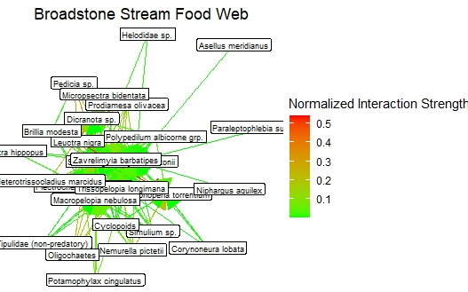</center>

Pretty interpretable! We can identify **food chains** from our web and locate the **apex predators** –note that some nodes, for example _Corduligester boltonii_ and _Macropelopia nebulosa_ are surrounded by many arrowheads. In addition, most species seem to be rather generalist with many links of low strength, with the exception of _Leuctra nigra_ being the dominant prey for _Siphonoperla torrentium_ and _Dicranotas sp._. 

<div style="background-color: #c4f5c9; padding: 15px; border-radius: 10px; border: 2px solid #c4f5c9;">
    In case there are still <strong>label overlaps</strong> after zooming, you can always <strong>save the plot as an image</strong> and adjust its width and height. For my sample code, this is my recommended dimensions:
    <pre style="background-color: #f6f6f6; padding: 10px; border-radius: 5px; border: 1px solid #ddd; overflow-x: auto;">
<code>ggsave("food_web_plot.png", plot = food_web_network, width = 15, height = 15, dpi = 300)</code>
    </pre>
    The image <code>food_web_plot.png</code> will be saved in the working directory.
</div>

### 2b.	Visualise data as heatmap with `ggplot2`

Food web networks give a holistic view of the ecosystem’s feeding relations, but in case you would like to focus more on the **quantitative aspects** of the web, **biomass flow heat map** is the better alternative since it displays interaction strength in a clearer manner compared to a food web network.

To build a heat map, we can stick to `ggplot2`, using the `geom_tile()` function. It creates rectangular tiles where the fill colour of each tile represents the value of a variable. Each tile corresponds to a specific **pair of variables** on the x and y axes (in our case, the predator and the prey), and the **colour gradient** encodes a **third variable**. Use the code below to build a simple heat map using our `food_web` data frame: 

```r
# Build a biomass flow heatmap (predator on horizontal axis, prey on vertical axis, colour represents normalized interaction strength)
heatmap_plot <- ggplot(food_web, aes(x = consumer, y = resource, fill = normalized_strength)) +
  geom_tile() + # Add a tile plot layer as the heatmap
  labs( # Add the title and labels
    title = "Food Web Heatmap of Interaction Strength",
    x = "Predator", 
    y = "Prey")
# Let's take a look at the heatmap
print(heatmap_plot) 
```
And the heat map should look similar to this: 

<center>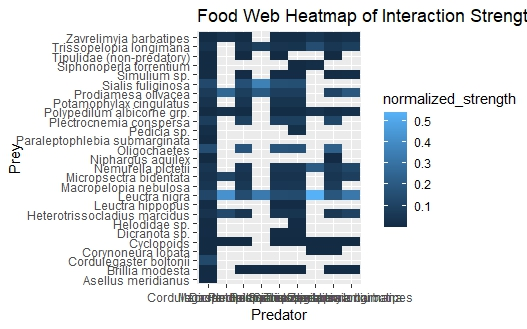</center>

We have just created the _most_ basic heatmap! Obviously, **there are some major issues with it** – the labels are horizontal by default on the x axis, the grid doesn’t align with the tiles, and the colours are not distinct enough from each other. We can fix those flaws with more lines of code:

```r
# Improve the heatmap
heatmap_plot <- ggplot(food_web, aes(x = consumer, y = resource, fill = normalized_strength)) +
  geom_tile(color = "#4d4d4d", size = 0.2) + # Colour the border so we can easily count the number of tiles
  scale_fill_gradient(low = "green", high = "red",# Change to a more distinctive colour gradient
                      name = "Normalized Interaction Strength")+  # Set the legend title here
  theme_minimal() + # choose a 
  labs(title = "Food Web Heatmap of Interaction Strength", # Add the title and labels
       x = "Predator", y = "Prey") +
  theme(
    axis.text.x = element_text(angle = 90, hjust = 1), # Rotate labels such that they don't overlap on the x-axis
    title = element_text(hjust = 0.5), # Centre the title
    panel.grid = element_blank(), # Removes confusing grid
  ) 
# View the heatmap
print(heatmap_plot)
```
A neat, readable plot is now ready: 

<center>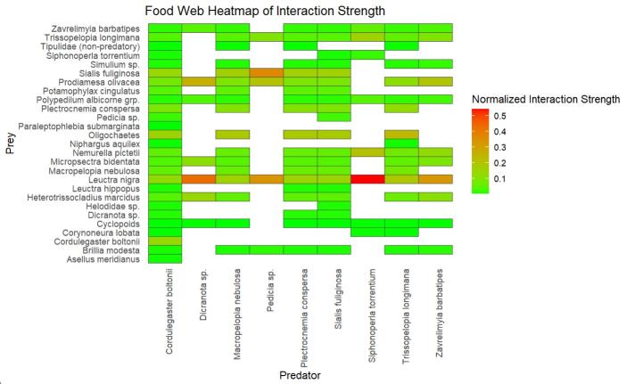</center>

Looking at this figure rather than food web network, we now take less effort to notice **which prey species is fed to highest number of predators** e.g. _Leuctra nigra_ (and vice versa) by counting the number of coloured boxes. We can also easily identify **specialist predators**, by looking for predator nodes with few total numbers of boxes that are dominantly red, e.g. _Dicranota sp._ and _Siphonoperla torrentium_. 

### 2c. Making the heatmap plot interactive

At this point, you might notice there’s still an unsolved problem with this graph – as a reader, we **can’t interpret normalized interaction strengths accurately** based on the colour gradient! 

But here's the trick – convert the heatmap into an **interactive plot** via `plotly`. `plotly` is a data visualization library that enables features like zooming, panning, tooltips, and real-time interactivity. In this tutorial, we will utilize this package to **display normalized strength values when our cursor hovers over the tile**. 

```r
# Convert the ggplot heatmap to an interactive plotly plot
interactive_heatmap <- ggplotly(heatmap_plot) 
# Display the interactive plot
interactive_heatmap
```

Here’s how the labels should show up when you hover over a tile:

<center>
  <iframe src="figures/interactive_heat_map.html" width="100%" height="500" frameborder="0"></iframe> 
</center>

Unfortunately, when converting `ggplot2` heatmap into an interactive object, **not all elements are kept**, e.g. the grey border of the tiles. In fact, there are libraries on R specialised in heatmaps that allows greater freedom in customizations. If you are considering making a more advanced heatmap, libraries like [`heatmaply`](https://github.com/talgalili/heatmaply) might be the perfect tool! 


<a name="section3"></a> 

### 3. Building functions for statistical analysis of food web data to investigate keystone species, using `igraph` and base R functions 

<figure style="text-align: center;">
    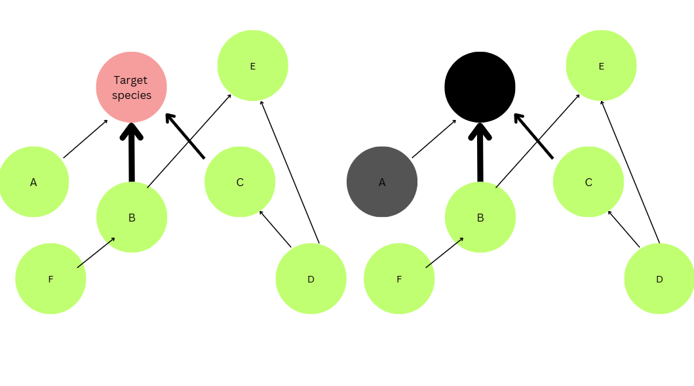
    <figcaption style="color: grey;">When the target species is removed, Species A, being only connected to the target species, will be considered 'disconnected'. Other species are not disconnected because they are linked to other species that has not been removed.</figcaption>
</figure>

In ecology, the removal of one species sometimes leads to the **disconnection** of other species from the food web. disrupting the flow of energy. 

This can lead to overpopulation of prey species, potentially causing overgrazing, resource depletion, and competitive imbalances, which negatively impact ecosystem stability and biodiversity. Possibly, chain reaction of changes in population sizes or behaviours across multiple trophic levels arise, and we call it **trophic cascade** .

Remember _Corduligester boltonii_ and _Macropelopia nebulosa_ with many connections in the food chain – can we expect them to be a particularly important species? If it is gone, will it lead to grand scale trophic cascade?  

We are going to find that out in this section by simulating the **effect of species removal on number of disconnections**. The more species disconnected when a top predator is removed, the greater the risk of disrupting ecosystem stability and function.  

### 3a. Preparing a Function for Species Removal Simulations

Let’s start off by **defining a function** that will allow us to **simulate species removal** and calculate how many species loses all feeding interactions as a result of the removal. A function is essentially a set of logical instructions to perform a specific task. We can define one with the `function()` command.  

Now, we want the function to:
    
    I. Read our food web plot, and know which species to remove.  
    II. Remove species.  
    III. Identify the species that become disconnected (extinct) as a result of the removal.  
    IV. Return the number of secondary extinctions.

Let's recall how to build a function. The format of a function is `function(“inputs”){“body”}`, where the inputs specify from which data frames to manipulate, and the body describes the actions of the function.  

#### I. Making the function read our food web and know which species to remove  

If we want the function to read our food web, the first thing we should input is obviously our `igraph` object `food_web_plot` that contains all feeding relationships. We also need to tell the function which species to remove, so let’s make another simple object:  

<figure style="text-align: center;">
    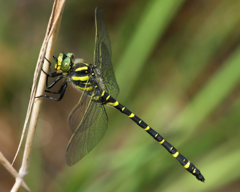
    <figcaption style="color: grey;">
        <em>Cordulegaster boltonii</em> (Golden-ringed dragonfly), a fierce predator that feeds on nymphs of other invertebrates in freshwater ecosystems. (Source: <a href="https://observation.org/species/619/" style="color: grey; text-decoration: none;">Harm Alberts on observation.org</a>)
    </figcaption>
</figure>


Throughout Section 3 I'll base all statistical calculations and results on _Cordulegaster boltonii_ , but you could always pick your own species instead. 

```r
# Define the species to remove 
target_species <- "Cordulegaster boltonii" # Replace Cordulegaster boltonii with the name of your species
```
<div style="background-color: #c4f5c9; padding: 15px; border-radius: 10px; border: 2px solid #c4f5c9;">
    If your species name is invalid, check if it exists using the below code (replace <code>“food_web_plot”</code> with your <code>igraph</code> object’s name if necessary):
    <pre style="background-color: #f6f6f6; padding: 10px; border-radius: 5px; border: 1px solid #ddd; overflow-x: auto;">
<code>species_list <- V(food_web_plot)$name
print(species_list)</code>
    </pre>
</div>

Now that we have defined the inputs, we can expect our function structure to look like this:  
<p style="text-align: center;"><code>function("food_web_plot", "species_to_remove"){…}</code></p>

#### II. Making the function remove the specified species  
When asking the function to perform a task, we can tell it to create new objects, that will become the output (or, the intermediate to an output). To remove the species, which is a vertex in the `igraph` object, we can use `delete_vertices` to **overwrite the food web** and turn it into a new object. We can anticipate the first line of our function body going:  

<p style="text-align: center;"><code>new_network <- delete_vertices(food_web_plot, target_species)</code></p>

#### III. Identify the species that become extinct as a result of the removal  
For the computer this can be further chopped into 2 steps – counting the number of intact links left and finding the species with no more intact links. Let’s go with:  

<p style="text-align: center;"><code>disconnected_species <- V(new_network)$name[degree(new_network, mode = "all") == 0]</code></p>

-	`V()` allows access to vertices in `new_network`
-	`degree(new_network, mode = "all")` calculates the number of connections for all nodes in the `new_network`
-	`mode = "all"` specifies to measure both incoming and outgoing connections. 
-	`== 0` sorts out which node has `0` connections.  

#### IV. Let the function tell us about how it goes  

Lastly, the function should give an output that _we_ can read. Let’s create one more object to contain everything we would like to know – how many species became disconnected when the selected species, _Cordulegaster boltonii_, is removed?  

The final chunk of the body would be:  

<p style="text-align: center;">
<pre><code>
# Return the number of trophic disconnections and species names
tibble(
    removed_species = unlist(target_species),  # Using list to keep species name(s) in a list format
    disconnected_species = unlist(disconnected_species),  # Store disocnnected species names
    disconnections = length(disconnected_species),
    remaining_species = vcount(new_network)
)
</code></pre>
</p>


-	A `tibble` data frame will be formed, showing **which species was removed, which species was disconnected as a result, how many species went extinct, how many are left**.  
-	When we want to display the species name that originates from the igraph object (which is comprised of lists, as we discovered in , `unlist()`ensures each list is converted to a character vector. 
-	Both `length()` and `vcount()` returns the number of items, but `vcount()`is a function from the `igraph` package specialised for counting items in `igraph` objects. 

Now, combine all the body lines into the `{}` bracket and there we go:  

```r
# Function to calculate secondary extinctions
calculate_disconnections <- function(food_web_plot, target_species) {
  # Remove the target species
  new_network <- delete_vertices(food_web_plot, target_species)
  
  # Identify species that are disconnected 
  disconnected_species <- V(new_network)$name[degree(new_network, mode = "all") == 0]
  
  # Return the number of disconnections and species names
  tibble(
    removed_species = unlist(target_species),  # Using list to keep species name(s) in a list format
    disconnected_species = unlist(disconnected_species),  # Store disconnected species names
    disconnections = length(disconnected_species),
    remaining_species = vcount(new_network)
  )
}
```
### 3b. Simulation of species removal to measure ecosystem impacts

In the last part, we have already defined which species to remove. Everything is ready. To start the simulation, all we’ve got to do is run the function now!

```r
# Call the function now and save results as a new object
result <- calculate_secondary_extinctions(food_web_plot, target_species)
print(result)
```

The output should look like this:

| removed_species         | disconnected_species             | disconnections | remaining_species |
|-------------------------|------------------------------|--------------------|-------------------|
| Cordulegaster boltonii  | Paraleptophlebia subm.       | 2                  | 26                |
| Cordulegaster boltonii  | Asellus meridianus           | 2                  | 26                |


When _Cordulegaster boltonii_ is removed, 2 species, _Asellus meridianus_ and _Paraleptophlebia submarginata_ become disconnected from the food web. The food web now only has 26 species remaining.

**Species with higher centrality to have a greater influence on the overall ecosystem** – their removal is likely to trigger a more significant cascading effect throughout the food web. So, how significant exactly is ‘2 disconnections’ ? 

### 3c. Evaluation of keystone species hypothesis using statistical analyses

The last step is to determine **whether our target species has caused _significantly_ more species to disconnect from our food web**, compared to the average value of removing another random species. 

<figure style="text-align: center;">
    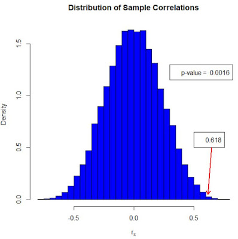
    <figcaption style="color: grey;">
        A permutation test will generate a 'null distribution'. Using this graph as an example, since 0.618 is close to the extremes in the null distribution, it is significantly higher than average, and null hypothesis is rejected. (Source: <a href="https://www.r-bloggers.com/2019/04/what-is-a-permutation-test/" style="color: grey; text-decoration: none;">Dave Giles on R bloggers</a>)
    </figcaption>
</figure>


Since we only calculated disconnections for 1 target species, and our food web is quite small, we won’t be able to use parametric tests like t-tests. Instead, we can run **non-parametric tests** that doesn’t don’t assume normality or equal variances, such as the **permutation test**. 

In our case, under the null hypothesis (no single species removal cause significantly more disconnections than another), any observed differences between random removals should be small and random. If the observed statistic is significantly different from what is expected, it would be considered "unusual," and we might be inclined to reject the null hypothesis (meaning _Cordulegaster boltonii_ cause significantly more disconnections). We would want our permutation test function to:
    I.	Run 1000 randomized trials
    II.	For each trial, randomly select 1 species only
    III.	 Calculate secondary extinctions when the random species is removed

#### I. Run 1000 randomized trials

<div style="background-color: #c4f5c9; padding: 15px; border-radius: 10px; border: 2px solid #c4f5c9;">
    Each time you run a function that randomly selects its inputs, the output varies. Therefore, before we begin with the function, we can set a <strong>seed</strong> so we could revisit our results with the exact same null distribution, using <code>set.seed()</code>.
    <p>Here’s a code snippet to show the magic of <code>set.seed()</code>. Try run it yourself!</p>
    <pre style="background-color: #f6f6f6; padding: 10px; border-radius: 5px; border: 1px solid #ddd; overflow-x: auto;">
<code>set.seed(123)  # Initial seed
random_numbers_1 <- sample(1:100, 5) 
print(random_numbers_1)
# If you run the same code later and set the seed to 123 again:
set.seed(123)  # Use the same seed
random_numbers_2 <- sample(1:100, 5)
print(random_numbers_2)</code>
    </pre>
    <p>You’ll notice that <code>random_numbers_1</code> is the same as <code>random_numbers_2</code>! Setting a seed is optional, but it increases reproducibility.</p>
</div>


Going back to our main objective – we need to tell R to execute the task 1000 times. We can use `replicate(“number of replicates”, {“tasks”})` for repeating tasks. 
Our code will start with something like this: 

<p style="text-align: center;"><code>replicate(1000, { ... })</code></p>

#### II. Randomly select 1 species only

Time to start off the body (`{}`) of our `replicate()` function. If we are tasking R to **randomly select figures or characters** from an existing data frame, we can use `sample(“data”, “number of samples”)`. 

Let’s make the first line of our body:

<p style="text-align: center;"><code>random_species <- sample(V(food_web_plot)$name, 1)</code></p>

We are trying to define `random_species`, i.e. tell the function which species to choose remove from the food web in the simulation. Here we allow the function to access our `igraph` object `food_weeb_plot`’s vertice (nodes) and pick 1 random name out of it. In the 1000 simulation runs, each `random_species` will be picked independently. 

#### III.	Calculate disconnections when the random species is removed

Finally, we calculate the number of secondary extinctions. Sounds familiar? Because we have already done something similar in 3a.

For the final line of the permutation test function, insert the function for secondary extinctions when target species is removed `calculate_disconnections()`– but change it up slightly. 

1.	Instead of `targeted_species`, replace the input with `random_species` we defined in the last step.
2.	Extract the disconnections data from the `tibble` output of `calculate_disconnections()`

<p style="text-align: center;"><code>calculate_disconnections(food_web_plot, random_species)$disconnections</code></p>

For a complete block of code that generates null distribution for random species removal, let’s stitch the pieces together:

```r
# Generate null distribution…
# We want 1000 random trials
null_distribution <- replicate(1000, { 
  # Randomly select 1 species only for each trial
  random_species <- sample(V(food_web_plot)$name, 1)
  # Calculate disconnection for the random species
  calculate_disconnections(food_web_plot, random_species)$disconnections
})
```
Last but not least, to statistically determine the significance of our results, run a very simple statistical test to obtain a **p-value**. 

```r
# Calculate the p-value
p_value <- mean(null_distribution >= observed_disconnections)
# Print the p-value
cat("P-value for the permutation test: ", p_value, "\n")
```
Our p-value is 1, suggesting that removing the target species _Cordulegaster boltonii_ .

**But does it mean as an apex predator, _Cordulegaster boltonii_ is not a keystone species?** Not necessarily. In fact, very often in freshwater ecosystems,  _Cordulegaster boltonii_ is considered a keystone species. It is most likely still important for other reasons not captured by this particular analysis, like nutrient cycling, population regulation of prey (which are predators of other species); or interactions not directly related to trophic structure. The results do NOT imply that the species can be removed without consequence, as trophic interactions and ecological dynamics might be influenced in more complex, indirect ways that aren't fully captured by this statistical test!

---------------------------

**Nonetheless, you have reached the end of the tutorial!** You are now competent in

-	Extracting and manipulating ecological data for food web visualisation
-	Visualising food web as networks using `igraph` and `ggraph`
-	Visualising biomass flow with heatmaps using `ggplot2`
-	Using `plotly` to enhance plot interactiveness
- Building functions that can tamper with `igraph` objects to simulate effect of species removal on food web
- Building functions to conduct permutation test to determine whether a species is significantly more influential than another, based on number of disconnections caused upon removal

Happy coding!


We can also provide some useful links, include a contact form and a way to send feedback.

For more on `ggplot2`, read the official <a href="https://www.rstudio.com/wp-content/uploads/2015/03/ggplot2-cheatsheet.pdf" target="_blank">ggplot2 cheatsheet</a>.

<hr>
#### Related tutorials: 
- [Graphics guide, mostly ggplot2](ase.tufts.edu/bugs/guide/assets/R%20Graphics%20Cookbook.pdf)

<hr>

#### Check out our <a href="https://ourcodingclub.github.io/links/" target="_blank">Useful links</a> page where you can find loads of guides and cheatsheets.

#### If you have any questions about completing this tutorial, please contact us on ourcodingclub@gmail.com

#### <a href="INSERT_SURVEY_LINK" target="_blank">We would love to hear your feedback on the tutorial, whether you did it in the classroom or online!</a>

<ul class="social-icons">
	<li>
		<h3>
			<a href="https://twitter.com/our_codingclub" target="_blank">&nbsp;Follow our coding adventures on Twitter! <i class="fa fa-twitter"></i></a>
		</h3>
	</li>
</ul>

### &nbsp;&nbsp;Subscribe to our mailing list:
<div class="container">
	<div class="block">
        <!-- subscribe form start -->
		<div class="form-group">
			<form action="https://getsimpleform.com/messages?form_api_token=de1ba2f2f947822946fb6e835437ec78" method="post">
			<div class="form-group">
				<input type='text' class="form-control" name='Email' placeholder="Email" required/>
			</div>
			<div>
                        	<button class="btn btn-default" type='submit'>Subscribe</button>
                    	</div>
                	</form>
		</div>
	</div>
</div>
